# FloraCRUD

## Descripción
Aplicación conjunta a un servicio de API en Laravel para hacer un curd. Usa recyclerview para mostrar todas las floras, usa glide para cargar las imagenes junto a un slider para mostrarlas en la pantalla específica de la flora.

Se pueden subir imagenes desde la flora específica o desde el menú principal seleccionando la flora en un desplegable.
Las acciones están en un botón flotante de menú.

## Capturas
### Pantalla principal
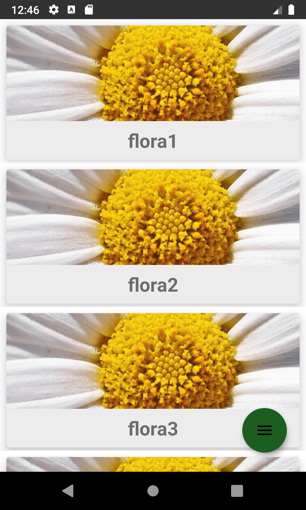

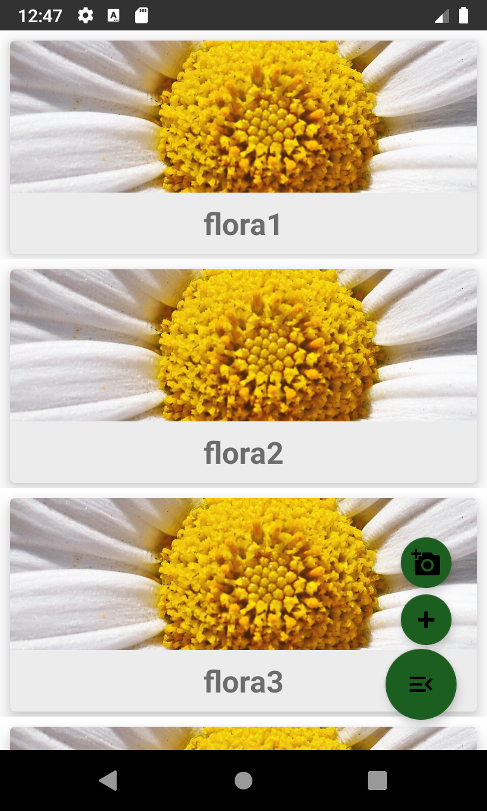

### Ver Flora
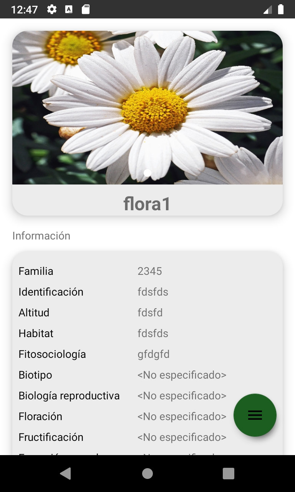
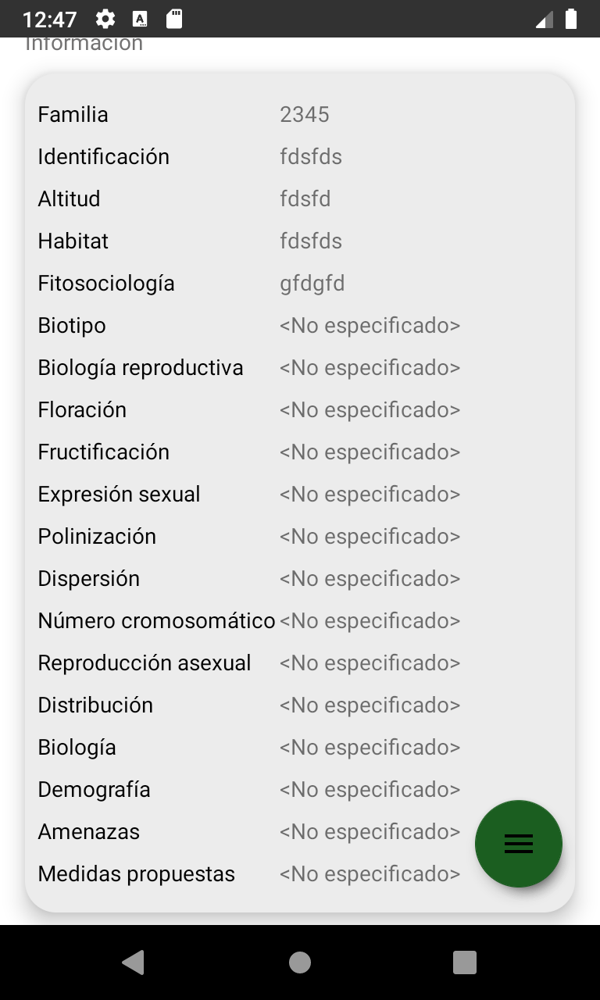
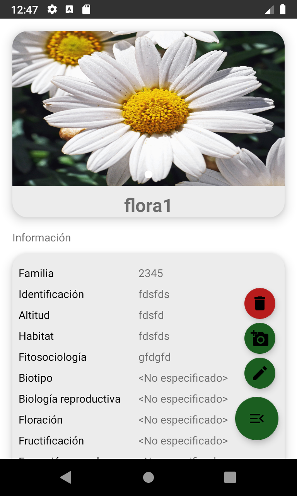

### Editar Flora
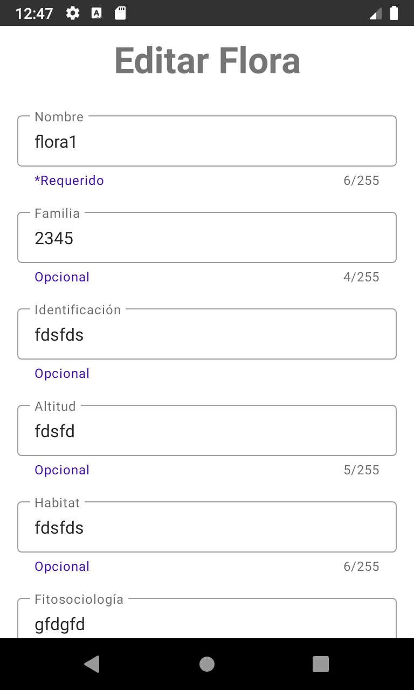

### Eliminar Flora
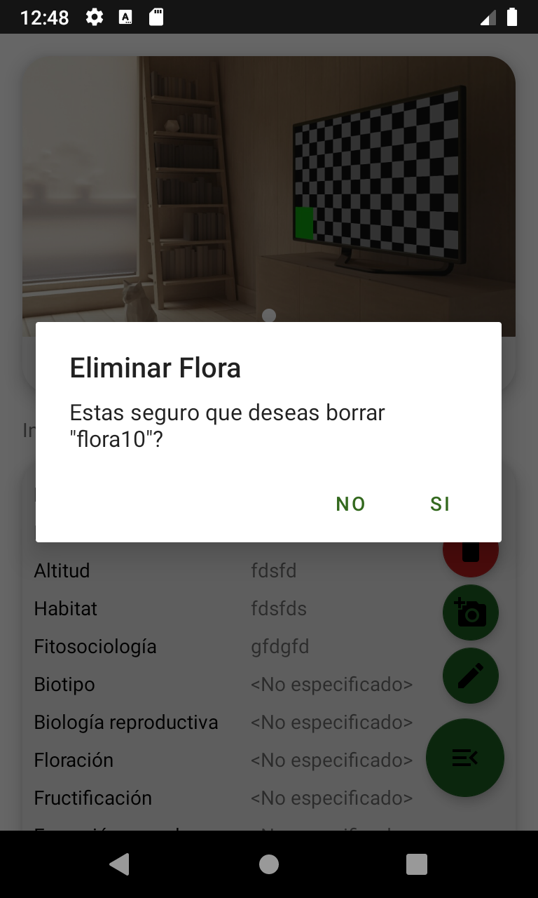

### Crear Flora
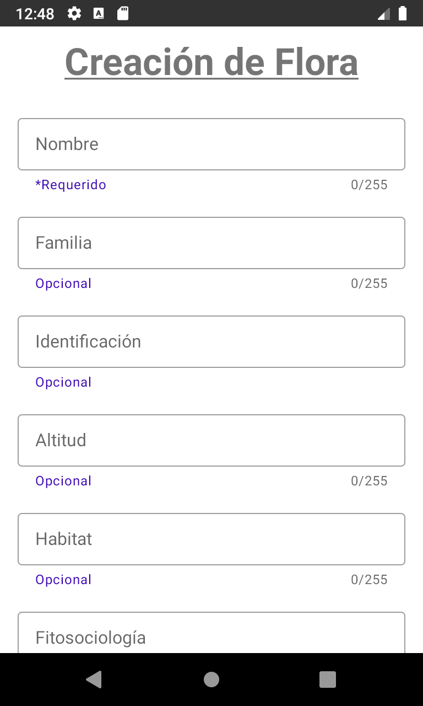
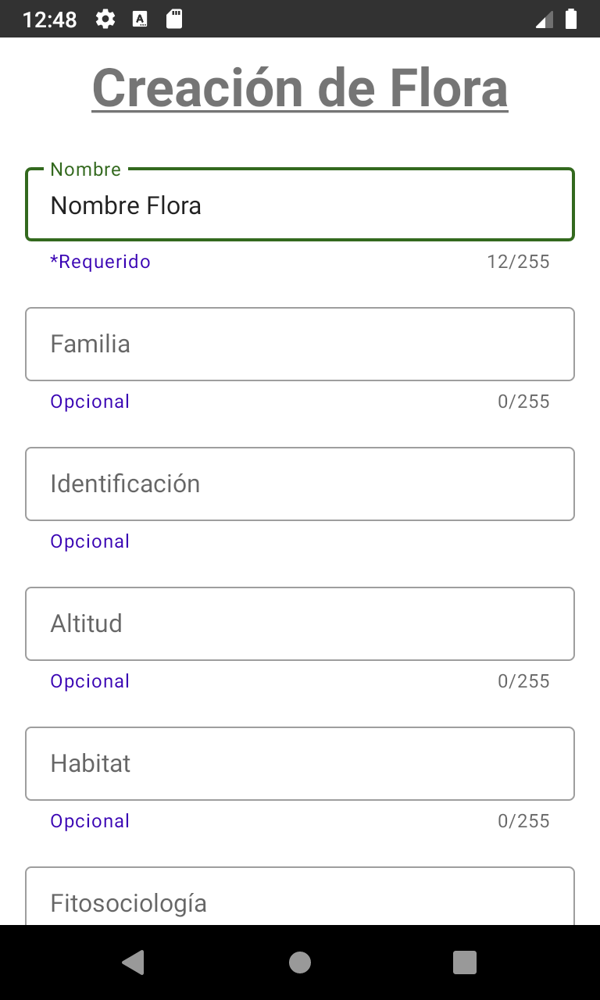

### Subir Imagen
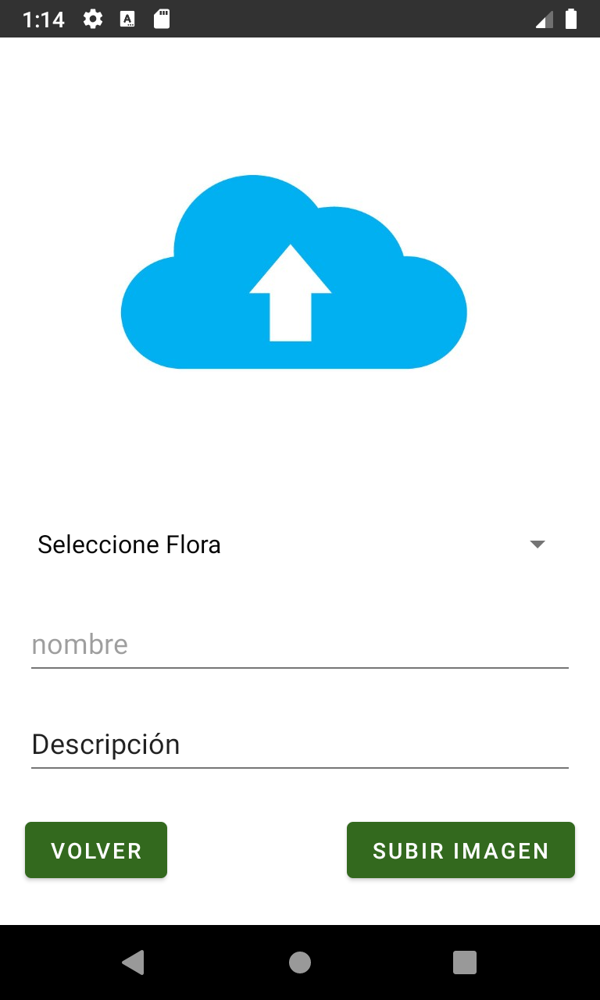

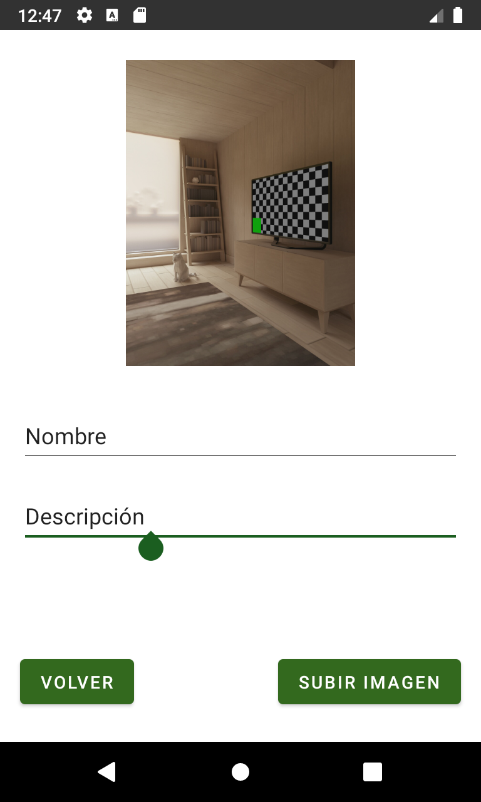

